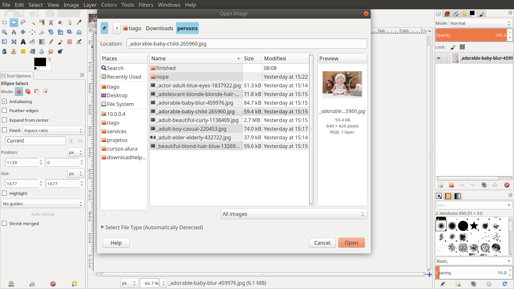
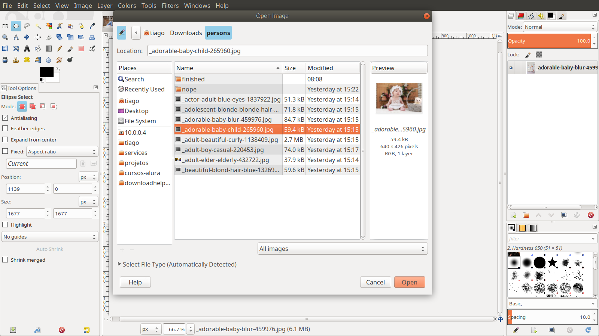

## Gimp

## Transofrmando imagem em circulo

- Abra o Gimp
- Abra a imagem `crtl + O`  
  

- Com a ferramenta `Elipse` (`ctrl + u`) selecione a parte que deseja deixar no circulo.
- Recote a area desejada `ctrl + x`  

- Crie uma nova camada transparente `ctrl + shift + n` 
- Cole a area recotada na nova camada  `ctrl + v`
- Ancore a image na nova camada 
- delete a camada de anterior
- vá no menu imagem e escolha a opção `autocrop` 
- vá no menu imagem e escolha a opção `scale image` para definir o tamanho da imagem.
- vá em file e escolha a opção `export as` (`ctrl + shift + e`)
- altere o nome para que fique com a extenção `.png` 
- click em `export` e novamente em `export` 